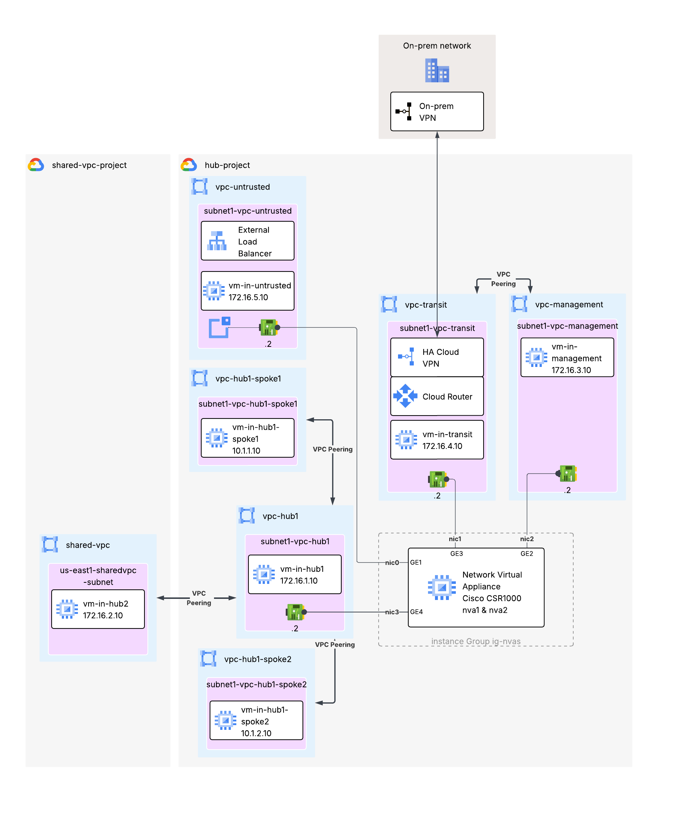

# Google Cloud Networking Infrastructure Blueprints

The blueprints in this folder implement typical network topologies like hub and spoke, or end-to-end scenarios that allow testing specific features like on-premises DNS policies and Private Google Access.

## Blueprints

### Hub-and-Spoke with Shared VPC

 This [blueprint](./hub-spoke-shared-host-vpc/) shows how to privately connect to on-premises services from GCP using a Cloud HA VPN, a central hub with NVA, peered to a Shared Host VPC project.

 

<!--### Hub-and-Spoke with Shared VPC with Cloud DNS-->